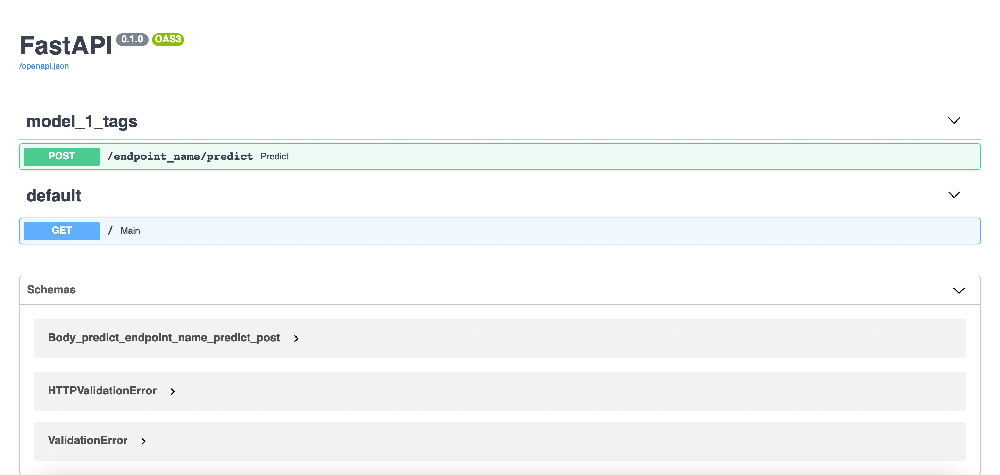

[](LICENSE)
# Lung segmentation API
API serving the lungs predictions for chest CT DICOM images. 

We use the Nvidia Clara lungs 3D semanticsegmentation model, avalible [here](https://ngc.nvidia.com/catalog/models/nvidia:med:clara_pt_covid19_ct_lung_segmentation).


API takes a CT scan, samples 32 samples from it and conducts 3D semantic segmentation. 
After that ot interpolate the predictions between the samples to achieve a segmentation 
mask for each frame and this is returned as a `.json` file.  



# How to run the API 

```
docker-compose up
```

# How to test it? 
Query the API with an example CT scan by running: 

```
python example_request.py
```

and the API output should be saved as `data.json`

# Authors
- [Piotr Mazurek](https://github.com/tugot17)
