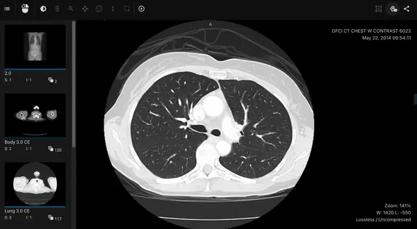

[](LICENSE)
# Lung segmentation API
API that returns lung segmentations for DICOM chest CT images and calculates lung volumes. 

We use the Nvidia Clara lungs 3D semantic segmentation model, available [here](https://catalog.ngc.nvidia.com/orgs/nvidia/teams/med/models/clara_train_covid19_ct_lung_seg).

The API takes a CT scan, extracts 32 samples from it, and performs 3D semantic segmentation. It then interpolates the
predictions between the samples to produce a segmentation mask for each frame and calculates the lung volume based on the DICOM metadata. 
The final result is returned as a `.json` file. 
To learn more about the structure see the [documentation](https://docs.zhiva.ai/latest/segmentation#get%2Fsegmentations%2F%7Bmodel-uid%7D%2Fstudies%2F%7Bstudy-uid%7D%2Fseries%2F%7Bseries-uid%7D)


  



# How to run the API 

```
docker-compose up
```

API avalible at:

```
0.0.0.0:8011
```

# FAQ
- I'm getting an error on MacBook `docker rpc error code = unknown desc = executor failed running [...]`.

Your docker settings are limiting the size of the image and cannot install all the `requirements.txt`. Go to `Preferences > Resources > Advanced` in your `Docker Desktop` application and increase the memory limit.

# How to test it? 
Follow the official [tutorial](https://docs.zhiva.ai/latest). You need to configure a proxy server that will route requests 
from the [viewer](https://alpha.zhiva.ai/login) to the model API.

You will need to add the endpoint to `models.json` file in [model-proxy](https://github.com/zhiva-ai/model-proxy-example)

```yaml
{
  "d4e548ad-f365-4c34-918b-4e61a8b896f0": {
    "uri": "http://localhost:8011/segmentation",
    "supports": ["/studies/series"],
    "task": "segmentation"
  }
}
```
